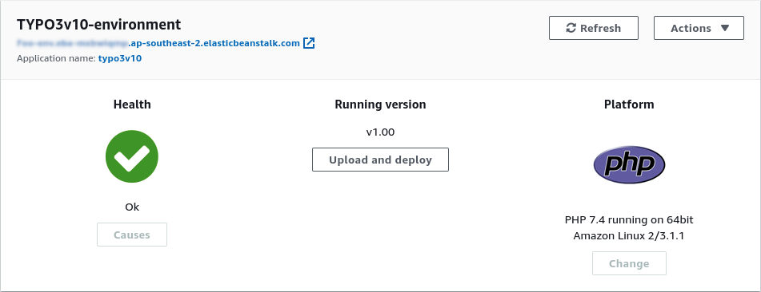

# TYPO3 on AWS Elastic Beanstalk

## Introduction

This Git repository contains all configuration files of a simple [TYPO3 installation](https://typo3.org) on [AWS Elastic Beanstalk](https://aws.amazon.com/elasticbeanstalk).

It is important to understand that this project aims to get you started with a basic setup.
It is by no means a complete, sophisticated, distributed infrastructure.
The main idea is to demonstrate a proof-of-concept and to provide a foundation you can build upon.


## Requirements

- An AWS account with approriate access permissions to use the services
- Basic understanding of TYPO3, AWS, web hosting, etc.


## Deployment

### Create the Application Source Bundle

I assume, you use the command line on your local machine for creating the application source bundle. The commands listed below clone this repository to your local machine and create a ZIP file of the contents of the `source/` folder.

```bash
$ git clone https://github.com/typo3-on-aws/typo3-on-elastic-beanstalk
$ cd typo3-on-elastic-beanstalk/source/
$ zip ../typo3.zip -r * .[^.]*
```

As the result of this process, you created a ZIP file `typo3.zip` which is the application source bundle.
This file will be uploaded to AWS Elastic Beanstalk in the next step.


### Configure, Upload, and Launch

Use the [AWS Management Console](https://aws.amazon.com/console/) and choose the region where you want to set up the environment.
Open the service **AWS Elastic Beanstalk** and click the button "Create Application" on the landing page (under "Get started").
Enter the following details:

| Label:                 | Value:                                  |
| :--------------------- | :-------------------------------------- |
| **Application name**   | `typo3v10`                              |
| **Application tags**   | *(optional)*                            |
| **Platform**           | PHP                                     |
| **Platform branch**    | PHP 7.4 running on 64bit Amazon Linux 2 |
| **Platform version**   | 3.1.1 *(or newer if available)*         |
| **Application code**   | Upload your code                        |
| **Version label**      | `v1.00` *(or similar)*                  |
| **Source code origin** | Local file                              |

Click button "Configure more options" (do not create the application yet).


### Configure Options

Use the preset **Single instance (Free Tier eligible)**.
Scroll down to the options and review the settings.
For a simple and basic setup, you can leave the default settings.

The main characteristics are as follows.

- Capacity ➜ EC2 instance type: `t1.micro`.
- No load balancer.
- Environment is not part of a VPC.
- No database.

You can select an existing EC2 key pair if you want to connect to the instance using SSH.
Alternatively, you can configure your public SSH key in file `uploads/.ebextensions/01-add-public-ssh-keys.config` (review and rename the sample file as required).
However, both options are optional.

Finally, click button "Create app".

After validating your configuration, AWS Elastic Beanstalk now creates the application and environment.
This will take a few minutes.
You can monitor the progress on the screen.

### Finish TYPO3 Installation


Once the build process has completed, you can access the environment dashboard:



Click the link at the top to open TYPO3's web-based install tool and finish the installation.

As no database server is currently installed on the EC2 instance, and we did not add a database in the "configure more options" step, you can choose **Manually configured SQLite connection** during the installation process.


## Copyright

TYPO3-on-AWS is a project by [t3rrific.com](https://t3rrific.com) and Michael Schams <[schams.net](https://schams.net)>.

This documentation and files included in the Git repository are licensed under a Creative Commons BY-NC-SA 4.0 International License. You are free to copy and redistribute the material in any medium or format for non-commercial purposes, if you attribute the author. Read all terms and conditions of the [CC BY-NC-SA 4.0 license](https://creativecommons.org/licenses/by-nc-sa/4.0/).


## Contribute

Feedback and [pull requests](https://github.com/typo3-on-aws/typo3-on-elastic-beanstalk/pulls) are welcome.
